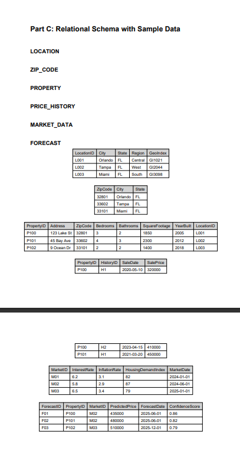

ER diagram:              
                   LOCATION
               ┌───────────┐
               │LocationID │
               │City       │
               │State      │
               │GeoIndex   │
               └─────┬─────┘
                     │ 1
                     │
                     │ M
                  PROPERTY
               ┌────────────┐
               │PropertyID  │
               │Address     │
               │City        │
               │State       │
               │ZipCode     │
               │SqFt        │
               └─────┬──────┘
                     │1
                     │
                     │M
               PRICE_HISTORY
               ┌─────────────┐
               │HistoryID    │
               │SaleDate     │
               │SalePrice    │
               └─────────────┘

PROPERTY M ───────< FORECAST >────── M MARKET_DATA
             ┌────────────┐
             │ForecastID  │
             │Predicted$  │
             │Confidence  │
             └────────────┘

              
| Attribute       | Type         |
| --------------- | ------------ |
| PropertyID (PK) | Identifier   |
| Address         | Mandatory    |
| City            | Mandatory    |
| State           | Mandatory    |
| ZipCode         | Mandatory    |
| Bedrooms        | Single-value |
| Bathrooms       | Single-value |
| SquareFootage   | Single-value |
| YearBuilt       | Optional     |

| Attribute       | Type                                |
| --------------- | ----------------------------------- |
| LocationID (PK) | Identifier                          |
| City            | Mandatory                           |
| State           | Mandatory                           |
| Region          | Optional                            |
| GeoIndex        | Mandatory (Location-based indexing) |

| Attribute          | Type         |
| ------------------ | ------------ |
| MarketID (PK)      | Identifier   |
| InterestRate       | Mandatory    |
| InflationRate      | Mandatory    |
| HousingDemandIndex | Single-value |
| MarketDate         | Mandatory    |

| Attribute              | Type       |
| ---------------------- | ---------- |
| HistoryID (Partial PK) | Identifier |
| PropertyID (FK)        | Mandatory  |
| SaleDate               | Mandatory  |
| SalePrice              | Mandatory  |

| Attribute       | Type       |
| --------------- | ---------- |
| ForecastID (PK) | Identifier |
| PropertyID (FK) | Mandatory  |
| MarketID (FK)   | Mandatory  |
| PredictedPrice  | Mandatory  |
| ForecastDate    | Mandatory  |
| ConfidenceScore | Optional   |

relationships: 
LOCATION (1) ───────────────< PROPERTY (M)     description: One location can contain many properties.
Each property belongs to exactly one location. 1 to many type

PROPERTY (1) ───────────────< PRICE_HISTORY (M) description: Each property can have many price history records.
PRICE_HISTORY is a weak entity. 1 to many type

PROPERTY (M) ───< FORECAST >─── (M) MARKET_DATA description: Many properties are analyzed using many market datasets.
FORECAST stores predicted pricing results and analytics output. many to many type 

PROPERTY (1) ─────────────── (1) INVESTMENT_PROFILE description: Each property has exactly one investment profile containing ROI, risk rating, and investment classification. 1 to 1 type
-----------------------------------------------------------------------------------------------------------------------------------------
BCNF
LOCATION(LocationID PK, City, State, Region, GeoIndex)

ZIP_CODE(ZipCode PK, City, State)

PROPERTY(PropertyID PK, Address, ZipCode FK, Bedrooms, Bathrooms, SquareFootage, YearBuilt, LocationID FK)

PRICE_HISTORY(PropertyID FK, HistoryID, SaleDate, SalePrice, 
              PK(PropertyID, HistoryID))

MARKET_DATA(MarketID PK, InterestRate, InflationRate, HousingDemandIndex, MarketDate)

FORECAST(ForecastID PK, PropertyID FK, MarketID FK, PredictedPrice, ForecastDate, ConfidenceScore)
-----------------------------------------------------------------------------------------------------------------------------------------
Functional Dependencies (FDs)

We now identify all non-trivial functional dependencies.

LOCATION

FDs:

LocationID → City, State, Region, GeoIndex

Candidate Key: LocationID

Since the determinant is a key → satisfies BCNF.

PROPERTY

FDs:

PropertyID → Address, City, State, ZipCode, Bedrooms, Bathrooms, SquareFootage, YearBuilt, LocationID

Potential real-world dependency:

ZipCode → City, State (if assumed true)

If we assume ZipCode → City, State, then:

PropertyID → ZipCode → City, State

This creates a transitive dependency, violating BCNF.

BCNF Decomposition (if ZipCode determines City/State)

Decompose into:

PROPERTY
PROPERTY(PropertyID PK, Address, ZipCode, Bedrooms, Bathrooms, SquareFootage, YearBuilt, LocationID)

ZIP_CODE
ZIP_CODE(ZipCode PK, City, State)

Now:

ZipCode → City, State

PropertyID → remaining attributes

All determinants are keys → BCNF satisfied.

If you do NOT assume that dependency, PROPERTY is already BCNF.

PRICE_HISTORY

FDs:

(PropertyID, HistoryID) → SaleDate, SalePrice

Composite key determines all attributes.
No partial dependency.
No transitive dependency.

BCNF satisfied.

MARKET_DATA

FDs:

MarketID → InterestRate, InflationRate, HousingDemandIndex, MarketDate

Key determines everything.
BCNF satisfied.

FORECAST

FDs:

ForecastID → PropertyID, MarketID, PredictedPrice, ForecastDate, ConfidenceScore

If ForecastID is surrogate key, BCNF holds.

However, logically:

(PropertyID, MarketID, ForecastDate) → PredictedPrice, ConfidenceScore

If this is true in your model, then that composite could be a candidate key.

Either way, determinants are candidate keys → BCNF satisfied.
-----------------------------------------------------------------------------------------------------------------------------------------
tables are included as pngs
